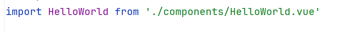

## 安装环境

1.安装nodejs
2.安装npm
3.安装vue cli
## 安装cli

1，安装cli
`npm i @vue/cli -g`


2.测试安装环境

`vue --version`


3.安装过程如下


选择vue2


选择npm


npm安装成功


`cd myqpp`这里是切换到安装目录
`npm run serve`启动命令


项目启动


成功启动界面


当然也可以同通过vue ui的方式创建项目

vue ui


## 打包项目
`npm run build`


## 本地运行dist
然后你会发现多了一个dist目录,但是这个时候，还不能直接
打开看,因为这是通过服务器的方式访问的html,但是我们可以下载
npm的服务器预览

**全局安装一个服务器**
`npm i serve -g`


然后我们可以使用serve命令启动：


`serve  dist`

然后本地3000端口就能看dist的网页代码了

## 常用目录说明
```c++
my-vue-project/
│
├── public/                  # 公共文件，静态资源
│   ├── index.html           # 入口 HTML 文件
│   └── favicon.ico          # 网站图标
│
├── src/                     # 源代码目录
│   ├── assets/              # 静态资源（如图片、字体等）
│   ├── components/          # 公共组件
│   ├── views/               # 页面视图组件
│   ├── router/              # 路由配置
│   │   └── index.js         # Vue Router 配置文件
│   ├── store/               # Vuex 状态管理
│   │   └── index.js         # Vuex Store 配置文件
│   ├── styles/              # 全局样式（如 CSS、SCSS）
│   │   └── main.scss        # 主样式文件
│   ├── utils/               # 工具类文件（如常用函数）
│   │   └── helper.js        # 示例工具文件
│   ├── App.vue              # 根组件
│   └── main.js              # 入口 JavaScript 文件
│
├── .gitignore               # Git 忽略文件
├── package.json             # 项目配置文件（包含依赖、脚本等）
├── README.md                # 项目说明文档
├── babel.config.js          # Babel 配置文件
└── vue.config.js            # Vue CLI 配置文件

```

## 组件化开发
### 1.组件化开发

我们可以把者四个选项封装一个组件
这是一个组件代码

结构、组件、逻辑<br>

### 2.如何使用组件
1.引入组件,类似于之前的引入模块



2.注册组件


3.整体代码：


